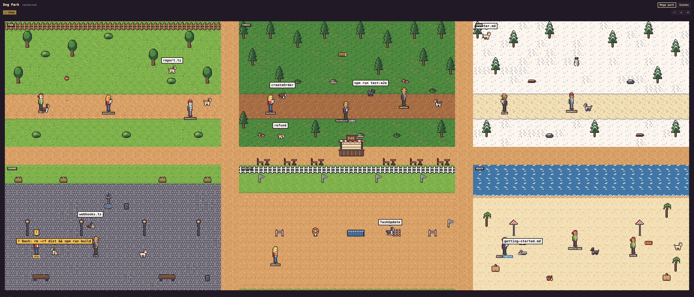
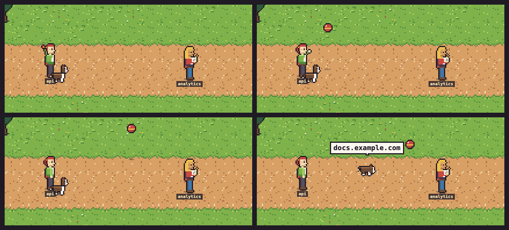
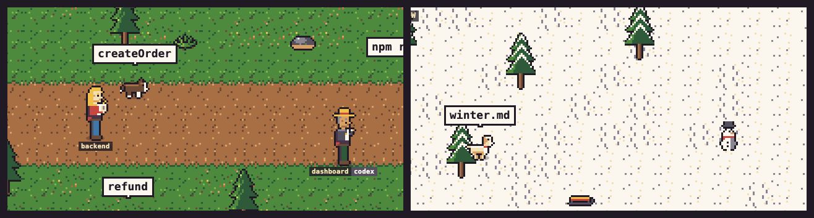
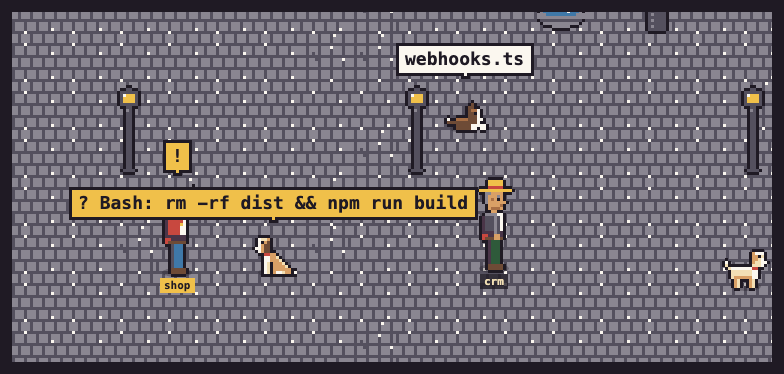
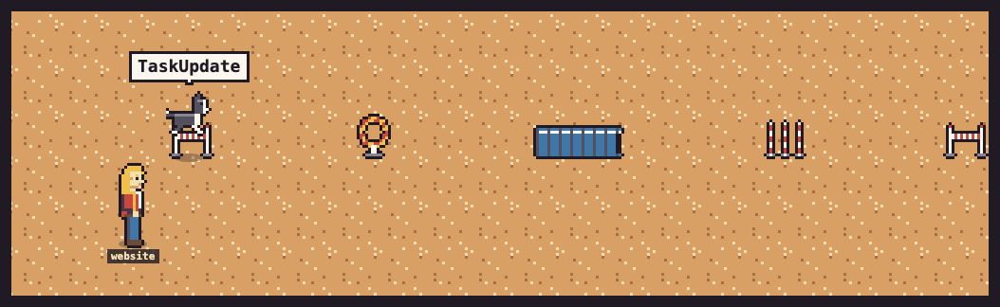
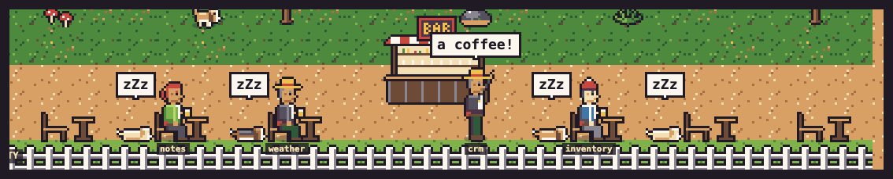

# zoomies · Dog Park

A pixel-art web view that shows, in real time, what your coding agents are
doing: **Claude Code**, **Codex** and **GitHub Copilot CLI**. Every session is a
**trainer** with their **dog**; every subagent is a **puppy**. Nothing is
simulated: it is fed by the real events these tools emit through hooks.



**Fetch.** On `WebFetch`/`WebSearch` the trainer winds up, throws a ball, bone,
frisbee or stick, and the dog sniffs around where it landed while the search
runs. When it finishes, it brings the toy back in its mouth.



**Searching and writing.** `Grep`/`Glob` send the dog sniffing (and digging on
natural ground), with the pattern in its bubble; subagents are puppies working
in their own zone. `Edit`/`Write` send it to a lamp post, tree or bin to lift
its leg.



**Asking for permission.** The dog sits and asks, the trainer points, and an
alert shows up at the top of the page.



**Agility.** Sessions that complete tasks move to the agility course, where
the dog jumps hurdles and the hoop and runs through the tunnel.



**The bar.** Idle sessions send their trainer for a drink under a flickering
neon sign, while the dog naps beside the chair.



## Status

Works end to end. One caveat: **the field names come from the official hooks
documentation of each tool and have not all been checked against real
recordings yet**, especially for Codex and Copilot CLI (see
[`docs/record-mode.md`](docs/record-mode.md)). In particular, it is still to be
confirmed that tool events inside a subagent carry `agent_id`. If they do not,
that activity is attributed to the companion instead of the puppy.

## Quick start

Requirements: Node 20 or later.

```sh
npm install              # installs and builds
npm start -- --open      # starts the server in the background and opens http://127.0.0.1:3737
```

The server keeps running after you close the terminal:

```sh
npm run status   # running? on which port, since when
npm restart      # after changing zoomies.config.json or updating zoomies
npm stop
```

Prefer to see its output in a terminal? `npm run serve` runs it in the
foreground (Ctrl+C stops it). To see the park without any agent, replay the
example recording in another terminal:

```sh
npm run demo
```

Optionally, `npm link` adds a global `zoomies` command, so you can run
`zoomies start`, `zoomies stop`, `zoomies status`, `zoomies open` (the park in
your browser), `zoomies logs` or `zoomies install-hooks` from any folder
(`npm unlink -g zoomies` removes it). The background server keeps its pid and
log in `run/` (git-ignored). Without it, use `node /path/to/zoomies/bin/zoomies.mjs`
wherever this README says `zoomies`.

## Connecting Claude Code, Codex or Copilot CLI

```sh
cd ~/projects/my-project
zoomies install-hooks   # asks which tool(s) to connect and which dog
zoomies install-hooks --platform codex --dog pug:black
# --platform: claude, codex, copilot, all, claude,codex…
# --dog: random (a different one per project), a breed (any of its coats), or breed:coat
```

Where the hooks go:

| Tool | Project level (default) | User level (`--user`) |
|---|---|---|
| Claude Code | `.claude/settings.local.json` (personal, not shared) | `~/.claude/settings.json` (or `$CLAUDE_CONFIG_DIR`) |
| Codex | `.codex/hooks.json` | `~/.codex/hooks.json` (or `$CODEX_HOME`) |
| GitHub Copilot CLI | `.github/hooks/zoomies.json` | `~/.copilot/hooks/zoomies.json` |

- **Without `--platform`**, it asks in the terminal; with no terminal it
  installs for Claude Code. Use `--project DIR` to pick another folder.
- **The dog**: without `--dog`, it asks too (with no terminal it leaves the
  dog alone). A breed goes into `companions` for that folder in
  [`zoomies.config.json`](#configuration-zoomiesconfigjson); with `--user`, into
  `companion` for every session. "Random" removes that setting, so the project
  gets its own dog from a hash of its folder. Restart the zoomies server
  (`zoomies restart`) to see it.
- **Codex and Copilot project files live inside the repository**: add them to
  `.gitignore` unless your team wants them. They are harmless elsewhere: the
  Copilot hooks always exit 0, so they can never block a tool, even on a
  machine without zoomies.
- **`--user`** affects all your sessions of that tool, so it asks you to
  confirm by typing "yes" (or pass `--yes`).
- **Installer safety**: it merges with what you already have without touching
  foreign hooks, makes a backup (`*.zoomies-backup-<date>`) before every write
  and writes atomically. It is idempotent, and if the existing JSON is invalid
  it stops without writing. `--dry-run` shows what it would do.
- **`uninstall-hooks`** (same options) removes only the zoomies handlers (and
  the `zoomies.json` file it wrote for Copilot).
- **Restart**: after installing, restart the tool (in Claude Code, `/hooks`
  shows them).
- **What each tool gives you**: Codex and Copilot send the same kind of events
  as Claude Code, so everything works the same, with two gaps in Copilot CLI:
  it does not report subagents as they start, so there are no puppies, and it
  has no tool-use ids, so parallel tools are not told apart. Sessions from
  Codex and Copilot carry a small badge next to the project name.

The hook runs `bin/zoomies-hook.cjs`, a dependency-free forwarder.

- It reads the hook's JSON and sends it to `127.0.0.1:3737/event`.
- It never writes to the terminal and always exits with 0.
- It takes about 30 ms per event.
- **`--source codex|copilot`** tells the server which tool sent the event
  (Claude Code when absent); the installer adds it for you.
- **With the server stopped, your tool works exactly the same**: the
  connection is refused instantly, and there is a 1 s cap in case anything
  hangs.

## The mega park

The main view is a single world with the six zones (park, forest, snow, square,
agility and beach) joined by avenues, and a **bar** in the middle of the
central avenue.

- **Plots**: every session gets a plot in its scene's zone, with its trainer,
  its dog and its puppies. There are 3 plots per zone; if the zone is
  full, the session goes to another one.
- **Travelling puppies**: some go to work in another zone depending on their
  type and come back when they are done. `Explore` goes to the forest, `Plan`
  to the square, `general-purpose` to the park and the rest to the beach.
- **The bar**: when a session has been done (or closed) for more than 5
  minutes, its trainer walks to the bar along the avenues, orders a drink at
  the counter and sits at one of the 6 terrace tables, sipping now and then,
  with their dog asleep beside the chair, under a flickering neon sign. With
  no free table, they stand at the counter. Clicking a trainer at the bar sends the session back to its plot.
- **Controls**: scroll or +/− to zoom, drag to move around and ⤢ to see
  everything. Clicking a trainer takes you to their plot.
- **Full screen**: the **⛶ Full screen** button next to Mega park / Scenes (or
  the F key) fills the screen with the view you are in, without the header,
  zoom buttons or hints. The mega park shows edge to edge and as big as the
  screen allows, with the lawn going on around it instead of black bars (zoom
  and drag still work); the scenes grow to fit the screen, kennel included.
  F or Esc leaves it. For a spare monitor or a
  TV, open `http://127.0.0.1:3737/?fullscreen=1` (add `&view=scenes` for
  the scenes): it starts that way, filling
  the window (browsers only allow the real full screen after a click, so press
  F or F11 once).
- **Alerts**: an alert shows up at the top for every session that needs you;
  clicking it takes you there (in full screen, they float over the park).
- **Scenes view**: the **Scenes** button (or `?view=scenes`) switches to one
  scene per session, with its own kennel for idle sessions. The choice is
  remembered in the browser.

Everyone moves across the terrain: trainers stroll around their plot (never
along the canvas edge) and face their dog, dogs wander, run laps or explore,
and nobody walks through trees, fences or water. Moving between zones or to the
bar goes along the avenues.

## What you will see

| What the agent does | What you see |
|---|---|
| The session starts | The trainer walks in; the dog trots in |
| You send a prompt | The dog pricks up its ears (`alert`) |
| `Read` | Lying down reading a sheet of paper (bubble with the file name) |
| `Grep`, `Glob` | Sniffs around; on natural ground (grass, dirt, snow, sand) it stops to dig now and then |
| `Edit`, `Write`, `MultiEdit` | Goes to a nearby lamp post, tree or bin and lifts its leg; with nothing to mark, it digs |
| `Bash` | Runs laps (the trainer raises their wrist and checks their watch) |
| `WebFetch`, `WebSearch` | The trainer winds up and throws a ball, bone, frisbee or stick towards the middle of the park; the dog sniffs around where it landed and, when the tool finishes, brings it back in its mouth and sits to hand it over. Several searches in parallel mean several toys in the air, fetched one by one |
| Task tools | Agility; in the agility zone the dog runs the whole course: hurdles, hoop, tunnel (it disappears and pops out the other end), slalom and a celebration at the finish |
| Launches a subagent (`Agent`/`Task`) | The trainer whistles and a puppy dashes off |
| A tool fails | Droopy ears (`sad`); not if you pressed Esc |
| Asks for permission | Sits asking ("?"), the trainer points ("!"), the scene flashes and the tab title warns you |
| Compacts the context | Shakes itself |
| Finishes (`Stop`) | Celebrates for a few seconds, then rests |
| 60 s without events | Falls asleep ("z" → "zZ" → "zZz"); never while a tool is still running |
| Exits (`SessionEnd`) | Both leave the park |

Peeing, a lap of the agility course and bringing back a toy are never cut
short: those tools often last less than a second, so whatever happens next is
applied once the action finishes.

Each project brings its own dog: a breed and coat picked from a hash of its
folder, so the same project always comes with the same dog (you can choose
it in the [configuration](#configuration-zoomiesconfigjson)). Puppies get a
breed from the subagent type:

- `Explore`: beagle.
- `Plan`: border collie.
- `general-purpose`: mutt.
- Other types: pug, dachshund or mutt, from a hash of the type.

The coat comes from the subagent id, so two puppies of the same type look
different. When it finishes, the puppy comes back with a bone.

Every project has its own trainer (5 styles × 4 skin tones, picked by hashing
the project: same project, same trainer).

In the scenes view, scenes are sorted by urgency: needs you, working, done,
closed. 4 are shown by default (`?max=N` to change it). The rest, and idle
ones, go to the **kennel**; clicking a card shows it again.

The full mapping is a data table in
[`src/mapping/table.ts`](src/mapping/table.ts); the logic that applies it is in
[`src/state/store.ts`](src/state/store.ts). How things move and what they do
on the terrain is in [`public/js/model.js`](public/js/model.js).

Decisions worth knowing:

- **Tool without its own state** (MCP, etc.): `alert`.
- **`sad`**: `StopFailure` (API error) and `PermissionDenied` (auto mode) make
  the dog sad. A failure caused by an interrupt (Esc) does not.
- **`asks`** comes from `PermissionRequest`. The `permission_prompt`
  `Notification`, which arrives about 6 s later, only counts if nobody was
  already asking.
- **`SessionStart` with `source: "compact"`** is not an arrival.
- **Event from an unknown subagent**: if it has an `agent_id` we do not know, a
  "ghost" puppy is created. `SubagentStop` events from unknown agents are
  ignored, because Claude Code also fires them for internal agents.
- **Timing**:
  - A puppy without events for 10 min comes back on its own (zombie).
  - A session without events for 30 min is removed.
  - A closed session is shown for 2 min.
  - Celebrating lasts 6 s; after that trainer and dog go back to rest.
- **Agility**: obstacles = distinct completed tasks (`TaskCompleted`,
  `TaskUpdate` to `completed`, `TodoWrite`). Note: on recent models the task
  tools are disabled by default (`CLAUDE_CODE_ENABLE_TODO_TOOLS=1` enables
  them).

## Configuration (`zoomies.config.json`)

Optional. Copy [`zoomies.config.example.json`](zoomies.config.example.json) to
`zoomies.config.json`, which is git-ignored because it holds your paths. Put it
in the zoomies folder or in the folder you start the server from, or pass it
with `--config`.

```json
{
  "scenarios": { "~/projects/blog": "forest", "~/projects/api": "park" },
  "agilityForTasks": true,
  "companions": { "~/projects/blog": { "breed": "pug", "coat": "black" }, "~/projects/api": "beagle" }
}
```

- **`scenarios`**: folder → `park`, `forest`, `agility`, `beach`, `square` or
  `snow`.
  - It applies to any session whose `cwd` is inside that folder; the most
    specific folder wins.
  - Without a match: park, forest, beach, square or snow from a hash of the
    `cwd` (same project, same scene).
- **`agilityForTasks`**: a session without a configured scene moves to agility
  when it completes its first task. Every completed task moves it one
  obstacle forward.
- **Dogs**: without any setting, each project gets its own dog from a hash of
  its folder. `install-hooks` can write these for you.
  - **`companions`**: folder → dog, like `scenarios` (the most specific folder
    wins). A dog is `{ "breed": …, "coat": … }` or just the breed: without a
    coat (or with `"random"`), each project gets a different coat of that
    breed, e.g. `"companion": "dachshund"` for a park full of different
    dachshunds.
  - **`companion`**: the same dog for every other session, e.g.
    `{ "breed": "dachshund", "coat": "red" }` for the classic look.
  - Breeds: `dachshund`, `beagle`, `border_collie`, `pug`, `mutt`; coats are
    listed under [Art](#art).

An error in the file stops startup with a message that says what is wrong.

## Privacy and security

**What the server receives**: the full JSON of every hook. It includes paths,
`cwd`, `transcript_path`, `tool_input` (commands, contents of written files),
`tool_response`, prompts and Claude's last message.

**What it keeps**: as soon as it arrives, each payload goes through
[`src/mapping/sanitize.ts`](src/mapping/sanitize.ts), which keeps only:

- Event and tool names, session, subagent and tool-use ids, and the subagent
  type.
- The bubble text (≤ 40 characters): the file name (not the path), the first
  line of the command, a URL's domain or the subagent description.
- Completed tasks as **hashes**, never their text.
- The `cwd` only in memory, to pick the scene. Only the folder name reaches the
  browser.

**What it drops**: `tool_response`, `transcript_path`, prompts,
`last_assistant_message`, file contents and everything else. No transcript is
ever read and **nothing is written to disk** except in `record` mode.

**Network security**:

- It only listens on `127.0.0.1`.
- Every route requires a loopback IP and a `Host` header of
  `127.0.0.1:<port>`/`localhost:<port>` (against *DNS rebinding*).
- `/event`:
  - Rejects any request with an `Origin`: a browser always sends one, the
    forwarder never does.
  - Requires JSON and a maximum size.
  - Allows at most 1000 events per minute and session.
  - Always answers without a body.
- The WebSocket only accepts an `Origin` of `http://127.0.0.1:<port>` or
  `http://localhost:<port>`. **An arbitrary web page cannot connect.**
- Static files are served only from `public/`, with a strict CSP and
  `nosniff`.
- **Why not `type: "http"` hooks**: Claude Code, Codex and Copilot all treat
  a hook's response as instructions. Any process squatting on the port could approve permissions.
  With a command hook that writes nothing, that response is ignored.

All of this is covered by tests, including one that sends a session full of
secrets through the WebSocket and checks that none of them shows up.

## `record`, `inspect` and `replay`

- **`serve --record`** (or `npm run record`; opt-in, with a warning) stores the **raw** payloads in
  `recordings/`, git-ignored and readable only by your user. Guide and list of
  cases to try in [`docs/record-mode.md`](docs/record-mode.md).
- **`inspect <file>`** summarises a recording without sensitive values: events,
  fields, latencies, ordering and subagent attribution.
- **`replay <file> [--speed N] [--max-gap S] [--keep-ids]`** resends a
  recording to `/event` with its timing.
  - By default it renames the sessions so they never mix with real ones.
  - It accepts recordings and hand-written files (one payload per line, with
    an optional `_delayMs`).
- **`examples/demo.jsonl`** is synthetic: it is generated by
  `examples/make-demo.mjs`, with two sessions that go through every state.

## Art

A custom pipeline, with no painted backgrounds or AI-generated characters.
Rules in [`STYLE.md`](STYLE.md).

- **Sources**: text grids with a fixed 16-colour palette
  (`art/palette.json`), reviewable in git.
  - `art/sprites/dog-<breed>.txt`: 5 breeds, adult and puppy.
  - `art/sprites/trainer.txt`: the trainer (5 styles).
  - `art/sprites/props.txt`, `toys.txt`, `bar.txt`: props, toys and the bar.
  - `art/tiles/*.txt`: 16×16 tiles.
  - `art/maps/*.json`: the scenes.
  - `art/variants.json`: coats and skin tones by colour remapping.
- **Build**: `npm run art:build` compiles into `public/art/` (PNG + JSON atlas).
- **Validation**: `npm run art:check` (also part of `npm test`) checks the
  palette, alpha 0/255, the 16 px grid, the outline and that everything is up
  to date.
- **External images** (e.g. AI-generated on a magenta background):
  `zoomies art normalize` turns them into a text source. It removes the
  magenta, rescales by nearest neighbour, quantises to the palette and adds the
  outline.
- **Viewing**: `zoomies art preview <sprite>` renders an enlarged strip.
  `http://127.0.0.1:3737/art-preview.html?map=park|forest|agility|beach|square|snow`
  is the test page.
- **Project skills** for producing art with Claude Code:
  `.claude/skills/dog-sprite`, `park-tile` and `prop-sprite`.

### Replacing the art

The frontend only talks to the art through
[`public/js/sprites.js`](public/js/sprites.js) and the atlases. To use other
art, produce `public/art/sprites.png` + `sprites.json` and `tiles.png` +
`tiles.json` in this format:

```json
{
  "version": 1,
  "image": "sprites.png",
  "grid": 16,
  "sprites": {
    "dog.dachshund.red": {
      "size": [16, 16],
      "anchor": [8, 15],
      "anims": { "idle": { "fps": 3, "frames": [[0, 0], [16, 0]] } }
    }
  }
}
```

- `frames` are top-left corners in the PNG.
- `anchor` is the point that rests on the ground (the feet).
- On-screen scaling is integer, nearest neighbour.

Sprites and animations the UI expects:

| Sprite | Size | Animations (frames @ fps) |
|---|---|---|
| `dog.<breed>.<coat>`, `pup.<breed>.<coat>` | 16×16, anchor (8, 15) | `idle` 2@3, `runs` 2@8, `asks` 2@2 (sitting), `alert` 2@3, `sad` 2@1, `sniffs` 2@3, `digs` 2@6, `fetches` 2@8, `agility` 2@4, `shakes` 3@10, `celebrates` 3@6, `sleeps` 2@1, `reads` 2@1, `returns` 2@6, `pees` 2@3, `jumps` 1@1, `arrives` 2@6, `leaves` 2@6, `dashes_off` 2@10 (the last three reuse the `runs` frames) |
| `trainer.<style>.<skin>` (styles `cap`, `beanie`, `long_hair`, `hat`, `ponytail`; skins `light`, `medium`, `brown`, `dark`) | 16×32, anchor (8, 31) | `enters` 2@6, `idle` 2@2, `notebook` 2@3, `stopwatch` 2@2, `whistles` 2@4, `points` 2@4, `celebrates` 2@4, `leaves` 2@6, plus `sits`, `drinks`, `stands`, `stands_drinking`, `winds_up` and `throws` 2@1 |
| `prop.ball`, `prop.bone`, `prop.frisbee`, `prop.stick`, `prop.table`, `prop.chair` | 16×16 | `default`; a toy may add `spin`, played while it flies (the frisbee does) |
| `toy.ball`, `toy.bone`, `toy.frisbee`, `toy.stick` (in the mouth) | 16×16, anchor (8, 8) | `default` |
| `prop.bed` | 32×16 | `default` |
| `prop.bar` | 48×32, anchor (24, 31) | `default` |
| `prop.bar_sign` (neon, on the awning) | 32×16, anchor (16, 15) | `default` 4@3 (flickers) |
| Tiles `park.*`, `forest.*`, `agility.*`, `beach.*`, `square.*`, `snow.*` | 16×16, anchor (0, 0) | `default` (full list in `STYLE.md` and the maps) |

Breeds and coats (`BREED_COATS` in `src/mapping/table.ts`):

- `dachshund`: red, black_tan, chocolate, cream, blue_tan, wild_boar.
- `beagle`: tricolor, lemon.
- `border_collie`: black, red, merle.
- `pug`: fawn, black.
- `mutt`: cinnamon, golden, grey, cream.

`npm test` checks that the atlas has exactly these sprites and animations.

## Development

```sh
npm start / npm stop # the server in the background (npm run status, npm restart)
npm run serve       # the server in this terminal (npm run record: in record mode)
npm run demo        # replays examples/demo.jsonl against it
npm test            # builds and runs every test (server, mapper, UI, art, installer)
npm run art:build   # rebuilds the art
npm run screenshots # regenerates the images in this README (needs Chrome)
```

See [`CONTRIBUTING.md`](CONTRIBUTING.md) for the full workflow (checks, art,
screenshots, optional lefthook git hooks) and [`AGENTS.md`](AGENTS.md) for the
guide coding agents follow in this repository.

```
bin/                zoomies.mjs (CLI) and zoomies-hook.cjs (hook forwarder)
src/                server, mapper, state, config, installer, replay, art pipeline
public/             frontend (HTML + framework-free Canvas 2D) and the generated public/art/
art/                art sources (text) and maps
test/               tests (vitest)
docs/               record mode, README images
scripts/            screenshot generator (headless Chrome)
examples/           example recording and its generator
```

Pending or known:

- Check the payloads against real recordings.
- No linter configured yet.
- Not tested on Windows.

## Acknowledgements

zoomies was inspired by
[Claude Office Visualizer](https://github.com/paulrobello/claude-office) by
Paul Robello, which turns Claude Code sessions into a pixel-art office. Go
check it out!

## License

MIT, see [`LICENSE`](LICENSE).
